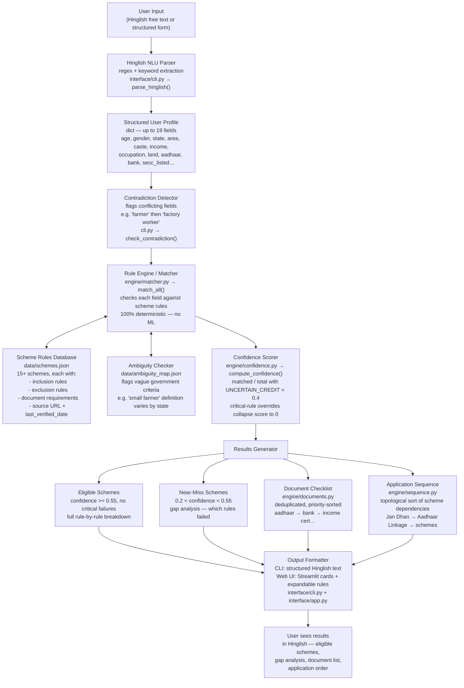

# KALAM — Architecture Document

**Project:** KALAM (Knowledge-Assisted Legal Aid for Marginalized)  
**Purpose:** Match Indian citizens to government welfare schemes through deterministic rule evaluation and a Hinglish conversational interface.  
**Version:** Post Entry-14 (all edge cases passing, 15 schemes covered)

---

## 1. System Diagram

### Complete Data Flow



### Component Classification

| Component | Deterministic? | Production Upgrade Path |
|-----------|---------------|------------------------|
| Hinglish NLU Parser | No — regex/keyword, ~70% coverage | Replace `parse_hinglish()` with LLM API call; function signature unchanged |
| Rule Engine / Matcher | **Yes** — explicit boolean/threshold checks | Add new scheme by adding a JSON entry + evaluator function |
| Confidence Scorer | **Yes** — formula: (matched + uncertain×0.4) / total | Tune `UNCERTAIN_CREDIT` weight; critical-rule overrides are hardcoded |
| Contradiction Detector | **Yes** — keyword comparison against stored profile | LLM could handle subtler contradictions |
| Ambiguity Map | **Yes** — static flags on known vague criteria | Human-curated updates when scheme rules change |
| Output Formatter | No — templated strings; limited expressiveness | LLM for natural, contextual Hinglish responses |
| Document Checklist | **Yes** — rule-derived from matched scheme documents | Auto-update when schemes.json is updated |
| Application Sequence | **Yes** — topological sort of a static dependency graph | Add/update edges in sequence.py when scheme prerequisites change |

### ASCII Fallback

```
User Input (Hinglish free text)
        |
        v
[DETERMINISTIC BOUNDARY: everything below is rule-based]
        |
        v
  parse_hinglish()          <- ONLY component that changes when upgrading to LLM NLU
  regex + keyword matching
        |
        v
  Structured Profile (dict)
        |
        +---> check_contradiction()  <- flags conflicting field updates
        |
        v
  match_all()               <- engine/matcher.py
  evaluates each scheme's inclusion + exclusion rules
        |
        +---> schemes.json           <- static rule database
        +---> ambiguity_map.json     <- flags vague / state-variable criteria
        |
        v
  compute_confidence()      <- engine/confidence.py
  score = (matched + uncertain*0.4) / total
  critical rule failure -> score = 0.0 (hard block)
        |
        v
  Results:
    +-- Eligible      (match_quality: strong / partial)
    +-- Near-miss     (match_quality: weak, confidence > 0.2)
    +-- Hard-blocked  (match_quality: ineligible, blocked_by != None)
    +-- get_document_checklist()     <- engine/documents.py
    +-- get_application_order()     <- engine/sequence.py (topological sort)
        |
        v
  Output Formatter              <- ONLY other component that changes with LLM upgrade
  CLI: structured Hinglish text
  Web UI: Streamlit cards
        |
        v
  User Output
```

---

## 2. Three Key Technical Decisions

---

### Decision 1: Rule-Based Matching vs. Embedding/ML-Based Matching

**Chosen:** Deterministic rule evaluation. Each scheme's eligibility is encoded as explicit boolean and threshold checks in `schemes.json`. Confidence scores are computed as `(matched_rules + uncertain_rules × 0.4) / total_rules` with critical-rule overrides that collapse scores to 0.

**Rejected alternatives:**

1. **Vector embedding similarity** — encode user profile and scheme descriptions as embeddings, rank schemes by cosine similarity.
2. **Classification model** — train a binary classifier on (profile, scheme) → eligible/ineligible using synthetic or historical data.
3. **Retrieval-augmented generation** — user query retrieves relevant scheme text, LLM judges eligibility from the retrieved passages.

**Why rejected:**

- **Explainability is non-negotiable.** Every confidence score in KALAM traces to specific rule evaluations. A similarity score of 0.73 tells no one why a user is or is not eligible. When a real person acts on eligibility information, they need to know exactly which criterion they satisfy and which they don't. Embeddings cannot provide this.

- **No training data exists.** Supervised classification requires a labelled dataset of (profile, scheme, eligible/ineligible) tuples. This dataset does not exist at scale for Indian welfare schemes, and synthetic generation would encode the very assumptions we are trying to test.

- **The domain is inherently rule-based.** Government eligibility criteria are written as explicit logical conditions: `age >= 18 AND income < 1,50,000 AND owns_land = True`. Encoding these as rules matches the structure of the source documents exactly. Encoding them as embeddings loses the logical structure.

- **Rules change at gazette-speed.** When a budget notification changes an income threshold from Rs. 1.5L to Rs. 2L, updating a JSON field takes 30 seconds. Retraining or re-prompting a model is unreliable.

**Tradeoff accepted:** Rule-based systems are brittle. Adding a new scheme requires writing rules manually — a developer task, not a data task. An ML approach could potentially generalise to new schemes from scheme text alone. For the current scope of 15 well-defined schemes with explicit eligibility criteria, rules are more accurate, fully explainable, and testable.

---

### Decision 2: LLM for Language Layer Only vs. LLM for Everything

**Chosen:** The NLU layer (Hinglish → structured profile) and the output formatter (structured results → Hinglish text) are the only components that use or would benefit from LLM. The matching engine, confidence scorer, document checklist, and application sequence are completely deterministic and never touch an LLM.

**Rejected:** End-to-end LLM approach — user input goes directly to a prompt like: *"Given this user's situation, which government schemes are they eligible for? User says: [free text]"*

**Why rejected:**

- **LLMs hallucinate eligibility criteria with high confidence.** This is the central failure mode KALAM is designed to prevent. In testing, LLMs confidently state incorrect income thresholds, miss exclusion clauses, and confuse similar scheme names. The harm of a false positive (person applies, gets rejected, loses time and money) outweighs the convenience.

- **LLM answers are not auditable.** If the system tells a real person in rural Bihar that they qualify for PM Kisan and they travel to the local office to find out they don't, there is no traceable reasoning to debug. With rule evaluation, every decision has a traceable log: `land_ownership` rule failed → `is_farmer` uncertain.

- **Testing is impossible for end-to-end LLMs.** KALAM has 15 deterministic edge-case tests that run after every engine change. You cannot write a unit test for an LLM eligibility determination — the same input can produce different outputs on different runs.

- **Scheme rules change frequently.** Updating a JSON rule file is a verified, reviewable change. Updating an LLM prompt to reflect new eligibility criteria is unreliable — the model may or may not respect the updated constraint across all inputs.

**Tradeoff accepted:** The system cannot handle novel eligibility questions outside its rule set. A user asking "What about PM Awas Yojana?" when that scheme is not in `schemes.json` gets no answer. An LLM could reason from raw scheme text. This is a known gap addressed in Section 3.

**The clean separation:** `parse_hinglish()` and the output formatter are the only functions that change when upgrading to an LLM. The matching engine API (`match_all(profile: dict) -> list[dict]`) is stable. This modularity was a deliberate design choice.

---

### Decision 3: Regex/Keyword NLU Parser vs. LLM-Powered NLU

**Chosen:** `parse_hinglish()` uses regex patterns and keyword dictionaries to extract structured fields from free-form Hinglish text. No external API calls. Runs offline.

**Rejected:** Replace `parse_hinglish()` with an LLM API call (Claude, Gemini, or GPT) that returns a structured JSON profile.

**Why rejected (for this prototype):**

- **API dependency = single point of failure and cost barrier.** The rule engine and the demonstration of KALAM's core value — deterministic eligibility matching — should not depend on API availability or rate limits.

- **For prototype purposes, keyword parsing is sufficient.** The goal of this version is to demonstrate that the rule engine works correctly. `parse_hinglish()` correctly handles the 15 test profiles and common natural language patterns. The 30% coverage gap exists but does not impede demonstrating the system.

- **The architecture is designed for this swap.** `parse_hinglish(text: str) -> dict` is a pure function with a fixed signature. The upgrade path is: replace the function body with an API call. Zero changes needed in `matcher.py`, `confidence.py`, `documents.py`, `sequence.py`, or either UI.

**Coverage of current keyword parser:**

| Input type | Approx. coverage |
|------------|-----------------|
| Age, gender (direct) | ~95% |
| State names and common aliases | ~90% |
| Occupation (Hinglish keywords) | ~75% |
| Income (amount + unit patterns) | ~80% |
| Boolean fields (haan/nahi/pata nahi) | ~90% |
| Complex sentences with code-switching | ~60% |
| Regional dialect variations | ~40% |
| Indirect phrasing ("mera beta kisan hai") | ~20% |

**Production path:** Replace `parse_hinglish()` body with:

```python
def parse_hinglish(text: str) -> dict:
    response = anthropic_client.messages.create(
        model="claude-haiku-4-5-20251001",
        system=EXTRACTION_SYSTEM_PROMPT,
        messages=[{"role": "user", "content": text}],
    )
    return json.loads(response.content[0].text)
```

The rest of the system is unchanged.

---

## 3. Two Most Critical Production-Readiness Gaps

---

### Gap 1: Scheme Data Staleness

**Problem:** Government eligibility criteria change through gazette notifications, budget announcements, and administrative orders. `schemes.json` is a static snapshot verified as of April 2026. The system has no mechanism to detect when a scheme's rules have been updated.

**Concrete risk:** PM Kisan's exclusion list, Ayushman Bharat's income threshold, and MGNREGA's wage rates are revised periodically. If the system gives a wrong eligible verdict to someone whose actual eligibility changed due to a rule revision — and that person acts on it — the harm is direct and traceable to the system.

**Why this is uniquely dangerous here:** Unlike a search engine that returns stale results (low stakes), KALAM gives eligibility verdicts that people may use to make application decisions, travel to government offices, or forgo other income-generating activity. False confidence is worse than acknowledged uncertainty.

**What production needs:**

1. **Monitoring pipeline** — automated watchers on `gazette.gov.in`, `myscheme.gov.in`, and ministry RSS feeds that detect scheme-related notifications.
2. **Change detection** — a diff system that extracts eligibility criteria from new gazette text and compares against current `schemes.json` entries. Flags divergences for human review.
3. **Human review gate** — AI can detect changes, but a domain expert must verify the updated rule before it enters `schemes.json`. No auto-update of eligibility criteria.
4. **Version control on scheme rules** — every change to `schemes.json` is a reviewed, dated commit with a source URL and the gazette reference.
5. **Last-verified timestamp display** — every scheme result shown to users includes: *"Rules last verified: [date] — confirm eligibility with your local office before applying."*

**Current mitigation in KALAM:** Each scheme entry in `schemes.json` carries a `source_url` and `last_verified_date`. The `ambiguity_map.json` flags every criterion that is known to be disputed, state-variable, or recently changed. These are surfaced as `uncertain` rules rather than hard failures, which proportionally reduces confidence scores and warns users.

---

### Gap 2: State-Level Variation

**Problem:** KALAM covers central government scheme criteria only. In practice, nearly every scheme has state-specific extensions, different income thresholds, additional eligibility conditions, or state-run complementary schemes that the central criteria do not capture.

**Concrete examples:**

- **Ayushman Bharat:** Tamil Nadu runs the Chief Minister's Comprehensive Health Insurance Scheme (CMCHIS) as a state extension with different coverage limits and eligibility. A Tamil Nadu user evaluated against only central AB criteria gets an incomplete picture.
- **MGNREGA:** The 100-day entitlement is central. Several states offer additional days. Wage rates vary by state.
- **PM Kisan:** Central scheme gives Rs. 6,000/year. Several states offer supplemental transfers (e.g., Telangana's Rythu Bandhu at Rs. 10,000/acre). The system misses the state component entirely.
- **Land definitions:** "Small farmer" is defined differently across schemes and may vary by state notification. KALAM flags this as uncertain but cannot resolve it.

**What production needs:**

1. **State-level rule overlays** — a `schemes_state_overrides.json` structure that extends or overrides central rules for specific states. Schema: `{scheme_name: {state: {overriding_rules}}}`.
2. **State scheme database** — a catalogue of state-run schemes indexed by state. NIC's MyScheme portal is the best starting point.
3. **At minimum, a disclaimer shown to every user:** *"Yeh sirf central government schemes hain. Aapke state mein aur bhi schemes ho sakti hain — apne District Collector office ya state portal se confirm karein."*
4. **District-level data** — a small number of schemes (PM JANMAN, tribal welfare schemes) have block or district-level eligibility conditions that cannot be covered even with state-level data.

**Current mitigation in KALAM:** The `ambiguity_map.json` flags every criterion that is known to vary by state with a `state_variable: true` marker. The confidence scorer marks these rules as `uncertain` (UNCERTAIN_CREDIT = 0.4) rather than assuming the central definition applies. The engine never makes a state-specific assumption silently.

---

## 4. Testing Strategy

### Edge Case Suite

**Files:** `tests/edge_cases.json` + `tests/edge_case_results.md`

15 profiles: 10 adversarial, 5 happy-path.

**Adversarial cases test:**

| Profile | What is being tested |
|---------|---------------------|
| Tenant farmer (land_ownership=False) | PM Kisan must not inflate to high confidence |
| No bank account | PMSBY hard-block; MGNREGA document check failure |
| Transgender applicant | Engine must not crash; BUG-008 (no transgender rules) documented |
| Minor (age=15) | AB has no age gate (SA-08 documented); weak, not strong match |
| Out-of-state disability | Cert portability not flagged (SA-09 documented) |
| Boundary income (monthly=10,000) | AB income threshold exact boundary |
| Auto driver + SC | Occupation evaluator mapping; AB urban transport rule |
| SECC-listed vs. asset exclusion | AB OR criterion logic |
| PM Vishwakarma artisan | trade_type field wired correctly to evaluator |
| Farmer with no documents | Uncertain rules reduce score; no false hard block |

**Happy-path cases verify:**
- Rural SC BPL woman → AB via secc_listed path
- Ideal PM Kisan farmer → owned land, all documents
- AB SECC beneficiary → best achievable confidence
- EPF member → EPS scheme unlocks correctly
- PVTG tribal → PM JANMAN eligibility path

**Protocol:** Edge cases run automatically after any change to `engine/matcher.py` or `data/schemes.json`. Results documented in `tests/edge_case_results.md` with before/after confidence table and full rule breakdown per profile.

### What is NOT tested (known gaps)

- `parse_hinglish()` coverage — no formal NLU benchmark suite. A production NLU layer would have its own evaluation dataset.
- State-specific rule variations — not implemented, not tested.
- Concurrent sessions / load — Streamlit single-threaded default.

---

## 5. Documented Failure Modes (by design)

The system is designed to fail in specific, safe, and documented ways. These are features, not bugs.

| Failure mode | System behaviour | Why this is correct |
|---|---|---|
| Parser cannot extract a field | Field absent from profile → rules using it become `uncertain` | Missing data is not the same as failing data. Uncertainty reduces confidence proportionally. |
| Critical rule fails | Confidence collapses to 0.0, `blocked_by` set, scheme marked `ineligible` | A farmer without land cannot receive PM Kisan regardless of how many other rules pass. |
| Unknown occupation string | Stored as raw string; matched against schemes with no occupation requirement; flagged uncertain elsewhere | Better than mapping to the wrong occupation and giving false confidence. |
| State-specific criterion | Marked `uncertain` in ambiguity_map; gets UNCERTAIN_CREDIT not full credit | Acknowledges ambiguity without refusing to score. |
| Engine finds zero eligible schemes | Returns all results as weak/ineligible with explanations | Never returns empty output — always shows what came closest and why. |
| User provides contradictory data | CLI: `check_contradiction()` flags it, asks for clarification. UI: toggle to correct field. | Contradiction is surfaced, not silently resolved. |
| Income data missing | `annual_income` absent → income threshold rules become `uncertain` | Rs. 0 is not the same as unknown income. The system never assumes zero. |

**Core principle:** *It is better to say "uncertain" than to give a wrong confident answer to someone who might act on it.*

---

## 6. File Map

```
CBC_recruitment/
|
+-- data/
|   +-- schemes.json          <- 15+ scheme rule sets (source of truth)
|   +-- ambiguity_map.json    <- known vague / state-variable / disputed criteria
|
+-- engine/
|   +-- matcher.py            <- match_all(profile) -> list[dict]; pure deterministic
|   +-- confidence.py         <- compute_confidence() + enrich_all(); critical-rule overrides
|   +-- documents.py          <- get_document_checklist(schemes) -> priority-sorted list
|   +-- sequence.py           <- get_application_order(results) -> topological sort
|
+-- interface/
|   +-- cli.py                <- Hinglish conversational CLI; parse_hinglish() lives here
|   +-- app.py                <- Streamlit web UI; imports parse_hinglish from cli.py
|
+-- tests/
|   +-- edge_cases.json       <- 15 test profiles
|   +-- edge_case_results.md  <- full documented results of last run
|   +-- test_engine.py        <- pytest suite
|
+-- docs/
|   +-- architecture.md       <- this document
|   +-- prompt_log.md         <- all prompts + outputs from this build session
|   +-- failure_log.md        <- bugs found and fixed during development
|
+-- CLAUDE.md                 <- project instructions and schema reference
+-- requirements.txt          <- anthropic, streamlit, pytest
```

---

## 7. Dependency Diagram

```
interface/app.py  -------------------------------------------+
interface/cli.py  ------------------------------------------+|
      |                                                     ||
      |  parse_hinglish()  [only NLU component]             ||
      |                                                     ||
      +---------------------------------------------------> vv
                                              engine/matcher.py
                                                     |  match_all()
                                                     |
                              +----------------------+
                              v                      v
                    data/schemes.json      data/ambiguity_map.json
                              |
                              +----------------------+
                                                     v
                                          engine/confidence.py
                                           compute_confidence()
                                           enrich_all()
                                                     |
                              +----------------------+
                              v                      v
                    engine/documents.py    engine/sequence.py
                    get_document_checklist  get_application_order
```

No circular dependencies. `engine/` modules do not import from `interface/`. `confidence.py` does not import from `matcher.py`. The data layer (`schemes.json`) has no code dependencies.
